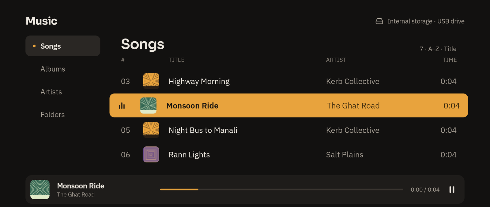
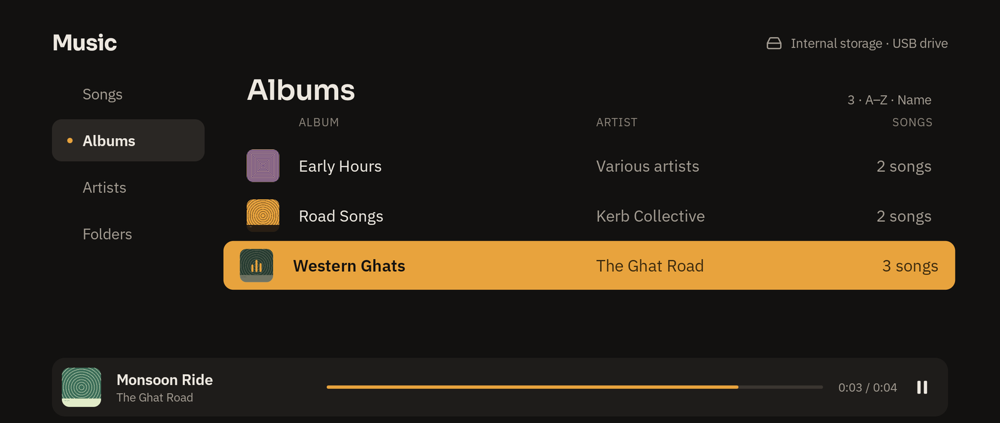
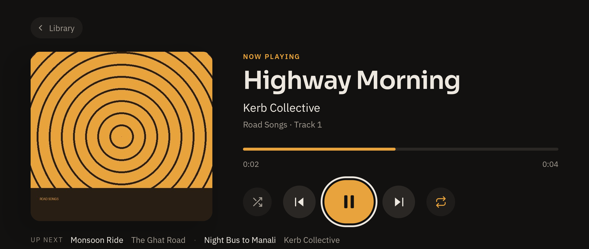

# Apna Audio Player

A music player for Android TV that plays the files you already have: songs on the
TV's own storage or on a USB stick plugged into it. No accounts, no streaming, no
internet needed.

I wanted something I could use from the sofa with just the remote. Most TV "media
players" I tried were either built for video or looked like a file manager, so I
made one that's properly usable with a D-pad.



| Albums | Now playing |
| --- | --- |
|  |  |

*(Screenshots use a handful of test tracks, not real albums.)*

## What it does

- Finds every audio file on the TV and on any USB drive, using Android's media library.
- Lets you browse by **Songs**, **Albums**, **Artists** or **Folders**. Playing something
  from an album (or artist, or folder) queues just that album.
- Shows album art. It uses the cover embedded in the file, and if there isn't one it
  looks for a `cover.jpg` / `folder.jpg` / `front.jpg` in the same folder.
- Has shuffle, repeat (off / all / one) and an "up next" line on the Now Playing screen.
- Works with the media buttons on your remote, whatever is on screen.
- Uses a dark, warm theme with big, high-contrast focus states, so you can always tell
  where you are from across the room.

## Using it with the remote

| Button | What happens |
| --- | --- |
| D-pad | Move around. The focused item turns amber. |
| OK / Select | Open a tab, album or folder, or play a song |
| Back | Close an album/folder, or go from Now Playing back to the library |
| ◀ / ▶ on the seek bar | Skip back / forward 10 seconds |
| Play/Pause, Next, Previous | Do what they say, from any screen |
| Fast-forward / Rewind | Skip 10 seconds |

"Previous" restarts the current song if you're more than 3 seconds in, like most players.

## Building it

You'll need a recent Android Studio (the project uses AGP 9.4 and Gradle 9.6). Gradle
downloads the JDK it wants on its own, so there's nothing else to install.

```bash
git clone https://github.com/akashpaswan1721/ApnaAudioPlayer.git
cd ApnaAudioPlayer
./gradlew assembleDebug
```

The APK ends up in `app/build/outputs/apk/debug/`.

### Putting it on a TV

Turn on developer options on the TV (on most TVs: *Settings → System → About*, then
press OK on the build number seven times), switch on network/USB debugging, then:

```bash
adb connect <your-tv-ip>:5555
./gradlew installDebug
```

It shows up in the TV's app row as **ApnaAudioPlayer**. It runs on phones and tablets
too (in landscape), but it's really built for a remote.

## Permissions

Just one: access to audio files (`READ_MEDIA_AUDIO` on Android 13+,
`READ_EXTERNAL_STORAGE` on older versions). The app has no internet permission, so
nothing leaves the device.

## Known limitations

- Music stops when you leave the app. There's no background playback service yet.
- No playlists or search yet.
- Playback goes through Android's built-in `MediaPlayer`, so which formats work
  (MP3, AAC, FLAC, OGG…) depends on what your TV supports.
- Sorting is fixed: songs and groups go A–Z, and albums play in track order. You can't
  change it yet.

## How the code is laid out

```
app/src/main/java/com/apnaaudioplayer/io/
├── MainActivity.kt      screen switching, permission, remote media keys
├── AudioRepository.kt   scans MediaStore on every storage volume
├── Player.kt            MediaPlayer wrapper: queue, shuffle, repeat
├── AlbumArt.kt          embedded + folder cover art, with a small cache
└── ui/                  Jetpack Compose for TV screens and components
```

It's all Jetpack Compose with the `androidx.tv` Material 3 components, with no extra
libraries.

## Credits

The UI uses [Sora](https://github.com/sora-xor/sora-font) and
[IBM Plex Sans](https://github.com/IBM/plex), both under the SIL Open Font License.
Their licenses are in [`licenses/`](licenses/).

## License

MIT. See [LICENSE](LICENSE). The fonts keep their own OFL license.
